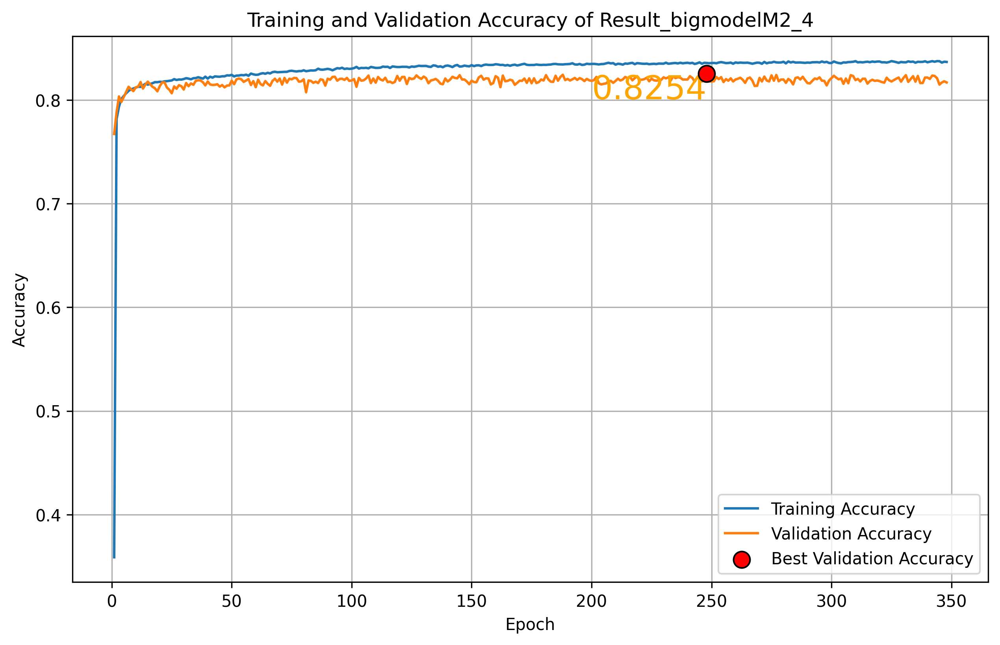
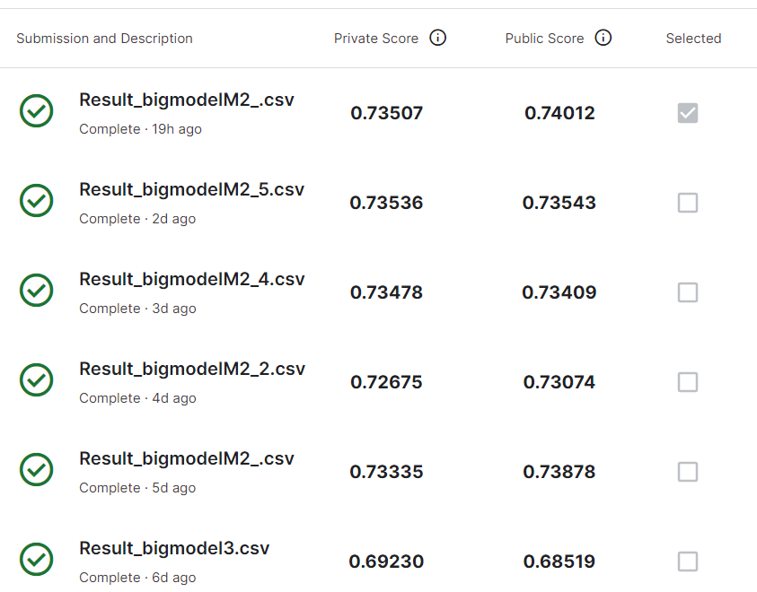

# Purdue-Face-Recognition-Challenge-2024
This challenge is to perform face recognition on a subset of Celebrity Face Dataset. You are asked to implement and train a machine-learning model to classify each image according to the face in it. There are 100 celebrity faces in total, so think of this challenge as a 100-class classification problem.

Go to the Data tab. The file train.zip stores all images of the training set. After you download and unzip it, the images will be arranged in the folder as 0.jpg, 1.jpg, …. Think of each image in the training set as x^(n). The file 'train.csv' stores all training set labels. Each row of the file stores the filename of an image and the celebrity name of the face in the image. Treat each label as the y^(n). The train.zip is about 13GB, so it might take a night to download it. Therefore, you can first download the train_small.zip, which is a smaller version of the training set, while you download the full dataset. The corresponding labels are stored in train_small.csv. The labels in the training set can be wrong in a small portion of the data, which is very common in real-world datasets. There might be multiple faces in some images, too. However, in the past offerings, students can still achieve nearly 90% prediction accuracy using such a noisy training set.

| Id     | Category |
|----------|-----------|
| 0 | Celebrity Name |
| 1 | Celebrity Name |
| ... | ...|

You can download the data set of images for training and testing by the link below:
[Data](https://drive.google.com/drive/folders/1gEAODMW99SSU-ijTAPR5RMhtvgj7ORS6?usp=sharing)

Hints

The images in the training and testing sets are not in the same dimension. Therefore, you might want to find a way to convert every image to the same shape before sending them into your machine-learning model.
As the challenge is only face recognition, the most useful information in the image is the face. Therefore, you might save your model a lot of effort by cropping out the faces using existing face detection tools, e.g., this one.
I recommend you use deep learning methods; otherwise, you need to handcraft the feature extraction function \phi(x). If this is your first time implementing a neural network, you might want to start with something simple. For example, you should first run the CNN on the MNIST dataset. Then, you should be able to follow this example to do image classification.
The small training dataset is only for you to debug your code temporarily. The number of images is insufficient to deliver a good performance.
You want to divide images in train.zip into two parts. The first part is your training set, which you will use to train your model, and the other part is the validation set, on which you monitor your model performance during training. The validation accuracy is a good approximation of the actual testing accuracy, as you don't have access to the ground truth labels of the testing set.
You want to monitor the training and validation loss closely during the training process. If the training loss is much lower than the validation accuracy, it means your model is overfitting to the training set. Ideally, your training and validation loss should both decrease at the beginning of the training process. At some point, training loss will keep decreasing, but the validation loss will start to increase. This is when you should stop training, as overfitting starts to happen.
Start early. You can only submit once every day, so your number of submission will be limited if you start two days before the due.

